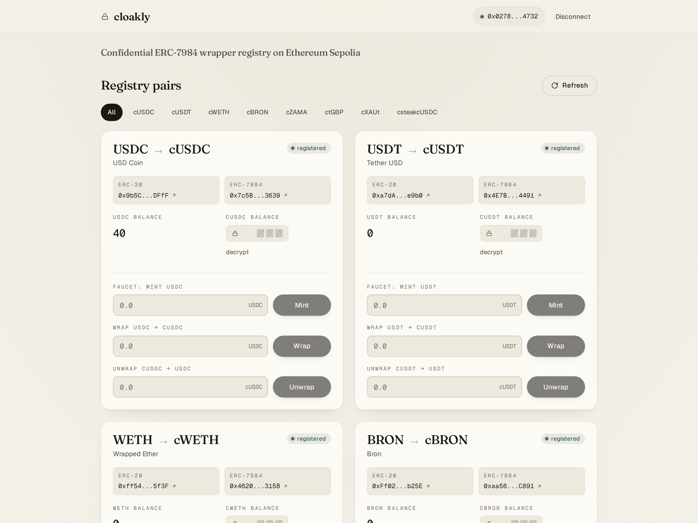
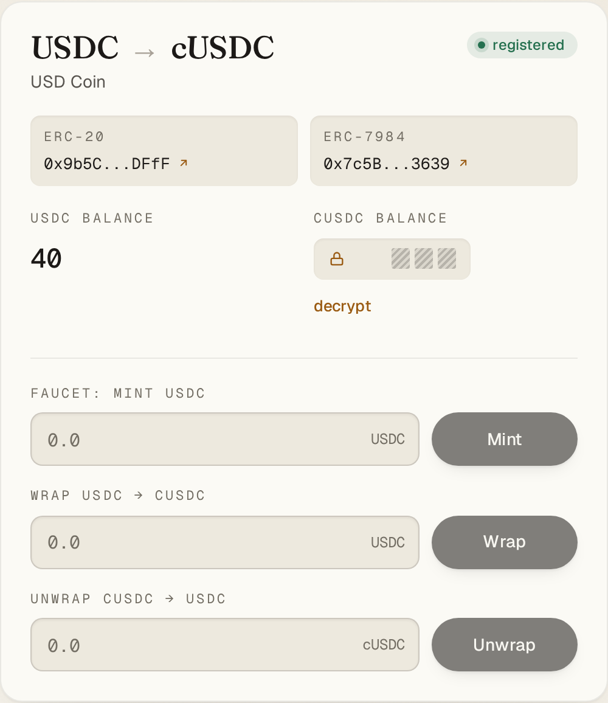
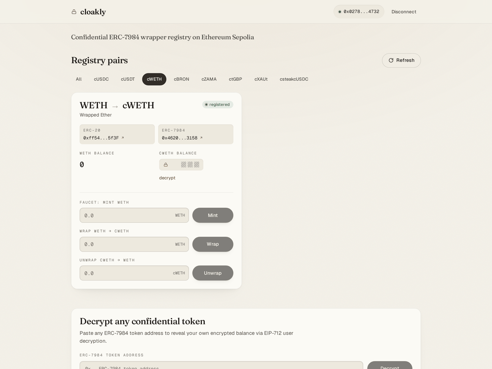
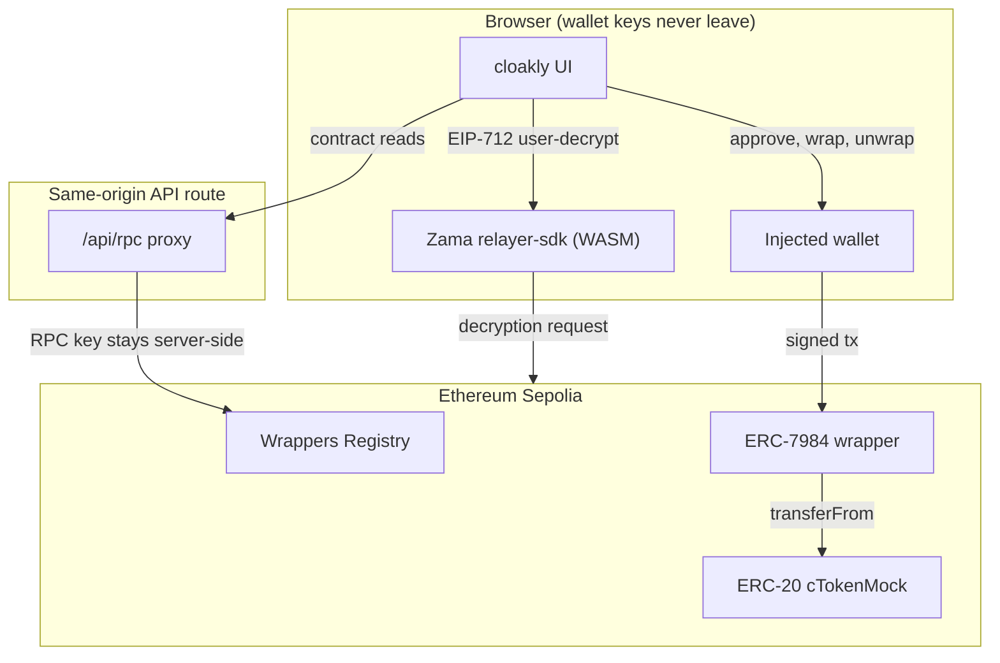
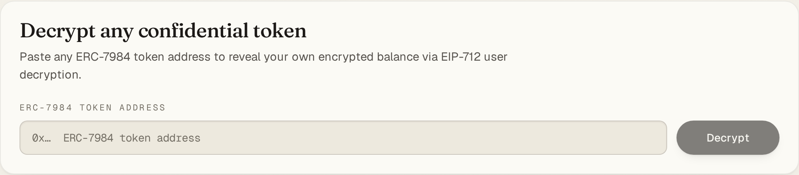

<p align="center">
  
</p>

<h1 align="center">cloakly</h1>

<p align="center">
  The official confidential-token Wrappers Registry, turned into a usable product.
</p>

cloakly reads the on-chain Zama Wrappers Registry on Ethereum Sepolia as its
source of truth, so every canonical ERC-20 to ERC-7984 wrapper pair is surfaced
live from chain, not a hardcoded list. Faucet the official cTokenMocks, wrap and
unwrap them, and user-decrypt the balance of any ERC-7984 token in your wallet,
in one app.

Built for the Zama Developer Program, Season 3, Bounty Track.


**Live on Sepolia:** https://cloakly-sand.vercel.app



| One pair, every action | Quick-pick a pair, no scrolling |
| --- | --- |
|  |  |

## 🎯 The problem

Many teams spin up their own test ERC-20s and ERC-7984 wrappers instead of the
ones already in the official registry. Integrations then ship against slightly
different tokens, they do not compose, and users end up holding look-alike
confidential assets that do not interoperate.

The canonical pairs already exist on chain, but the registry is a contract, not a
product: nothing lets a developer or user find the pairs, faucet them, wrap and
unwrap them, and decrypt them in one place. cloakly closes that gap and makes
using the existing wrappers the path of least resistance.

## 🔐 What it does

- **Browse the registry.** Reads `getTokenConfidentialTokenPairs()` on the
  Wrappers Registry (`0x2f0750Bbb0A246059d80e94c454586a7F27a128e`) and renders
  every pair with its metadata: symbol, name, decimals, and both the ERC-20 and
  ERC-7984 addresses, each linking to Sepolia Etherscan.
- **Faucet the official cTokenMocks.** Mints test ERC-20 to your wallet through
  the public `mint(address,uint256)` on each `ERC20Mock`, so you can try the
  flow immediately. Non-mock tokens correctly show no faucet.
- **Wrap.** ERC-20 `approve` (only when allowance is short) then `wrap(to,
  amount)` on the confidential wrapper, waiting for the receipt.
- **Unwrap.** A two-transaction flow: `unwrap` burns the confidential amount and
  emits `UnwrapRequested`, the app public-decrypts the burned amount, then
  `finalizeUnwrap(requestId, cleartext, proof)` releases the ERC-20.
- **Decrypt any ERC-7984 balance.** EIP-712 user-decryption of the connected
  wallet's own balance for any token address, registry pair or not, through a
  paste-an-address panel.
- **Quick-pick.** A filter toggle above the grid jumps straight to any pair, so
  a wallet full of pairs never means scrolling.

## 🧭 How it works



Every contract read goes through a same-origin `/api/rpc` route so the RPC
provider key (`SEPOLIA_RPC_URL`) stays on the server and never reaches the
browser. Transactions are signed by the injected wallet directly. Failure paths
are handled explicitly: a short allowance triggers an `approve` before `wrap`; an
amount over balance stops before any transaction with a distinct message; a
wallet on the wrong chain shows a switch-to-Sepolia banner; a token with no
public faucet hides the mint action. Because unwrap is two transactions, the
burn happens first; if `finalizeUnwrap` is not mined, the request id and its
public cleartext are recoverable and `finalizeUnwrap` is permissionless, so the
release can be retried.

## 🗂 How the registry is sourced

The source is hybrid, with the chain as the primary truth:

1. **On chain (primary).** `useTokenPairs` reads
   `getTokenConfidentialTokenPairs()` from the registry every load. This is the
   canonical set; anything registered on chain appears with no code change.
2. **Verified catalog (metadata).** Known pairs are enriched from
   `src/lib/tokens/catalog.ts` for clean display symbols and faucet flags.
3. **On-chain fallback (metadata).** Any registered pair not in the catalog has
   its `symbol`, `name`, and `decimals` read directly from its contracts.
4. **Local config (extension).** `src/lib/tokens/local-pairs.ts` is merged on
   top for custom or not-yet-registered pairs. A registry pair with the same
   confidential address always wins, so local entries never shadow the chain.

## ➕ Adding a new pair

There are two documented paths, in order of preference.

**1. Register it on chain (canonical, no app change).** The registry owner calls:

```solidity
registry.registerConfidentialToken(erc20TokenAddress, confidentialWrapperAddress);
```

The registry validates that neither address is zero and that the wrapper
implements ERC-165 and ERC-7984. On the next load (or the Refresh button)
cloakly reads the new pair and renders it automatically, because the on-chain
registry is the source of truth.

**2. Declare it locally (for custom or dev-only pairs).** Append a `TokenPair` to
`LOCAL_PAIRS` in `src/lib/tokens/local-pairs.ts`:

```ts
export const LOCAL_PAIRS: readonly TokenPair[] = [
  {
    underlying: "0xYourErc20Address",
    confidential: "0xYourErc7984WrapperAddress",
    isValid: true,
    source: "local",
    underlyingSymbol: "DAI",
    confidentialSymbol: "cDAI",
    name: "Dai Stablecoin",
    underlyingDecimals: 18,
    confidentialDecimals: 6,
    hasPublicFaucet: false, // true only if the ERC-20 exposes mint(address,uint256)
  },
];
```

Save and the pair shows up in the grid and the quick-pick toggle. If the same
confidential token is later registered on chain, the on-chain entry takes
precedence automatically.

## 🔗 Live on Sepolia

**Wrappers Registry:** [`0x2f0750Bbb0A246059d80e94c454586a7F27a128e`](https://sepolia.etherscan.io/address/0x2f0750Bbb0A246059d80e94c454586a7F27a128e)

The app surfaces every official cTokenMock in the Sepolia registry docs, read
live from chain. As of this writing the registry returns nine pairs: the seven
cTokenMocks below, the non-mock `ctGBP`, and one extra registered pair
(`csteakcUSDC`) that is on chain but not yet in the docs, which appears precisely
because the registry, not a hardcoded list, is the source of truth.

| Symbol | Underlying ERC-20 | ERC-7984 wrapper | Faucet |
| --- | --- | --- | --- |
| cUSDCMock | `0x9b5Cd13b8eFbB58Dc25A05CF411D8056058aDFfF` | `0x7c5BF43B851c1dff1a4feE8dB225b87f2C223639` | yes |
| cUSDTMock | `0xa7dA08FafDC9097Cc0E7D4f113A61e31d7e8e9b0` | `0x4E7B06D78965594eB5EF5414c357ca21E1554491` | yes |
| cWETHMock | `0xff54739b16576FA5402F211D0b938469Ab9A5f3F` | `0x46208622DA27d91db4f0393733C8BA082ed83158` | yes |
| cBRONMock | `0xFf021fB13cA64e5354c62c954b949a88cfDEb25E` | `0xaa5612FA27c927a0c7961f5AEFEE5ba3A0F9C891` | yes |
| cZAMAMock | `0x75355a85c6FB9df5f0C80FF54e8747EEe9a0BF57` | `0xf2D628d2598aF4eAF94CB76a437Ff86CA78FfbFB` | yes |
| ctGBPMock | `0x93c931278A2aad1916783F952f94276eA5111442` | `0xfCE5c7069c5525eF6c8C2b2E35A745bA20a2F7CC` | yes |
| cXAUtMock | `0x24377AE4AA0C45ecEe71225007f17c5D423dd940` | `0xe4FcF848739845BC81Dee1d5352cf3844F0a60C7` | yes |
| ctGBP | `0xf6Ef9ADB61A48E29E36bc873070A46A3D2667ff3` | `0x167DC962808B32CFFFc7e14B5018c0bE06A3A208` | no |

Decrypting any ERC-7984 balance works beyond this table: paste any confidential
token address into the decrypt panel.



## 🚀 Reproduce it

Prerequisites: [Bun](https://bun.sh) 1.3+ and a Sepolia RPC URL (for example an
Infura or Alchemy endpoint). Node is not required; the toolchain is Bun.

```bash
git clone https://github.com/Andy00L/cloakly
cd cloakly
bun install

# Server-only RPC endpoint. Copy the example and add your key.
cp .env.example .env.local
# then edit .env.local: SEPOLIA_RPC_URL=https://sepolia.infura.io/v3/<your-key>

bun run dev     # http://localhost:3000 (webpack dev server)
# or
bun run build   # production build
bun run start   # serve the production build
```

Success looks like: the home page loads, connecting an injected wallet on Sepolia
renders the registry grid, and `bun run build` exits `0`. The RPC key is read
only on the server by `src/app/api/rpc/route.ts`; it is never sent to the client
and never committed (`.env.local` is git-ignored).

## ⚠️ What is real and what is mocked

- **The test tokens are official cTokenMocks.** They are real contracts on
  Sepolia, but "mock" test tokens with a public `mint`, listed in the Zama
  registry docs for exactly this purpose. There is no real value at stake.
- **The RPC provider key is proxied, not exposed.** `SEPOLIA_RPC_URL` lives in
  `.env.local` and is used only server-side through `/api/rpc`. No key is bundled
  into the client.
- **Injected wallets only.** MetaMask and compatible browser-extension wallets.
  WalletConnect was intentionally left out to avoid an external relay dependency.
- **Sepolia only.** The requirements target Sepolia; the mainnet registry address
  exists in the Zama docs but this app is scoped to the testnet.
- **Unwrap reveals the unwrapped amount by design.** The OpenZeppelin
  `ERC7984ERC20Wrapper` finalizes an unwrap with the publicly decrypted burned
  amount, so the unwrapped quantity is public while every confidential balance
  stays encrypted until its holder decrypts it.

## 📦 Repository layout

```
src/app/            Next.js App Router: layout, page, /api/rpc proxy, icons
src/components/      UI: dashboard, token card, decrypt panel, sealed-reveal, header
src/lib/actions/     Flow hooks: faucet, wrap, unwrap, decrypt (errors as values)
src/lib/registry/    useTokenPairs: the hybrid onchain + local registry reader
src/lib/tokens/      TokenPair type, verified catalog, local-pairs extension point
src/lib/contracts/   Registry, wrapper, and ERC20Mock ABIs and addresses
src/lib/fhe/         relayer-sdk instance and encrypt / decrypt operations
docs/                README screenshots and the app icon
```

## 📜 License

MIT. See [LICENSE](LICENSE).
